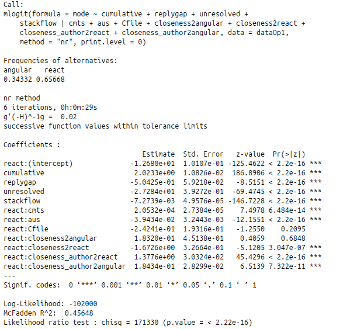

# PackageAdoptionAnslysis
This repository implemented an approach for software package adoption analysis, which was proposed in our paper. The data source were collected by leveraging WoC open source mining infrastructure, mentioned in paper WoC.
scripts folder contains all scripts used and result folder contains calculated data (predictors) ready to feed in a regression model.
## How it works? Entrance: npm_commands.sh (predictors calculation)
```
# This command only runs once for every ecosystem, e.g., npm, RCRAN, etc.
cd scripts
mkdir pkgjson
sh pkgjson.sh

# Since calculating different variables requires reusing shared data, the running order has been optimized for performance
mkdir angularVSreact

# Calculating Cum, Cmts and Aths
sh AusCmts_npm.sh angular angularVSreact pkgjson
sh AusCmts_npm.sh react angularVSreact pkgjson
sh AusCmtsforboth.sh angular react angularVSreact

# need to be run on da3 (mongoDB access)
# first step for calculating RplGp
sh replygapBefore.sh angular react angularVSreact angular/angular.js facebook/react
sh replygapAfter.sh angular react angularVSreact

# Calculating Unrslvd
sh unresolved.sh angular angularVSreact
sh unresolved.sh react angularVSreact

# need to be run on da3 (mongoDB access)
# now using Questions score > 20. No answers.
# Calculating StckExch
sh stackoverflow.sh angular react angularVSreact

# Calculating Prx2TD and Prx2DT (DT=angular, TD=react)
sh dependencyclosenessBefore_npm.sh angular react angularVSreact
sh dependencyclosenessMulti_npm.sh angular angularVSreact pkgjson
sh dependencyclosenessMulti_npm.filter3.sh angular angularVSreact pkgjson
sh dependencyclosenessMulti_npm.sh react angularVSreact pkgjson
sh dependencyclosenessMulti_npm.filter3.sh react angularVSreact pkgjson
sh dependencyclosenessAfter.sh angular react angularVSreact

# Calculating AthPrx2TD and AthPrx2DT (DT=angular, TD=react)
sh authorcloseness_npm.sh angular angularVSreact angular_angular.js
sh authorcloseness_npm.sh react angularVSreact facebook_react
sh authorclosenessforboth.sh angular react angularVSreact

# Calculating C
sh Cfile.sh angular angularVSreact
sh Cfile.sh react angularVSreact

```

## Ready to fit regression model:
```
cd scripts
Rscript choiceModel.R
```

## Result:
     
